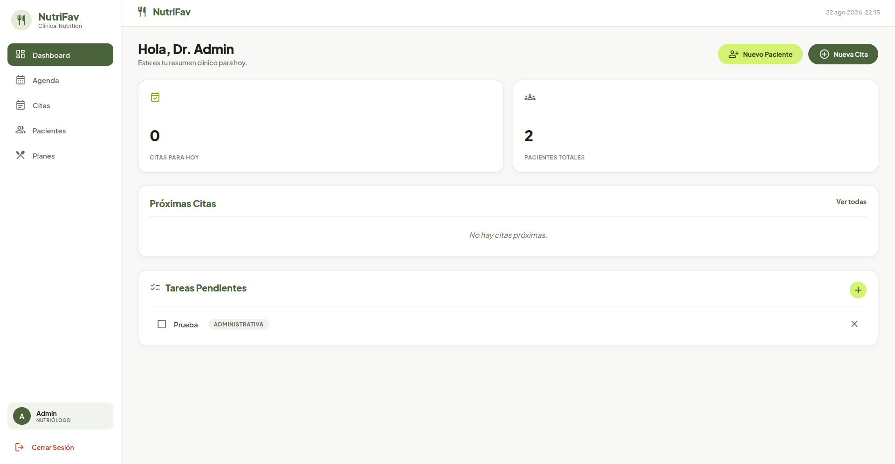
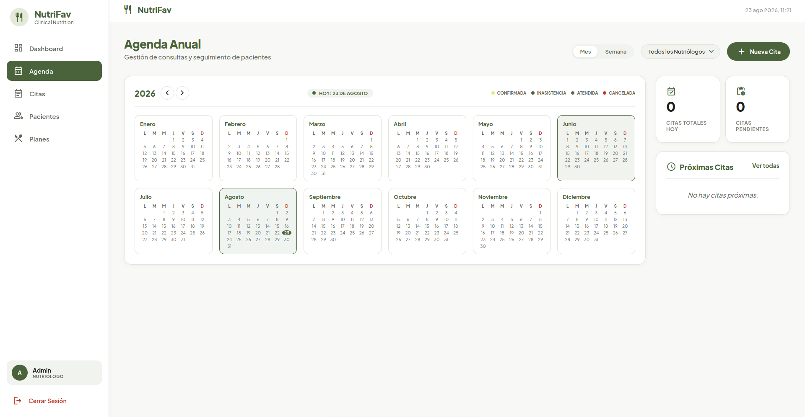
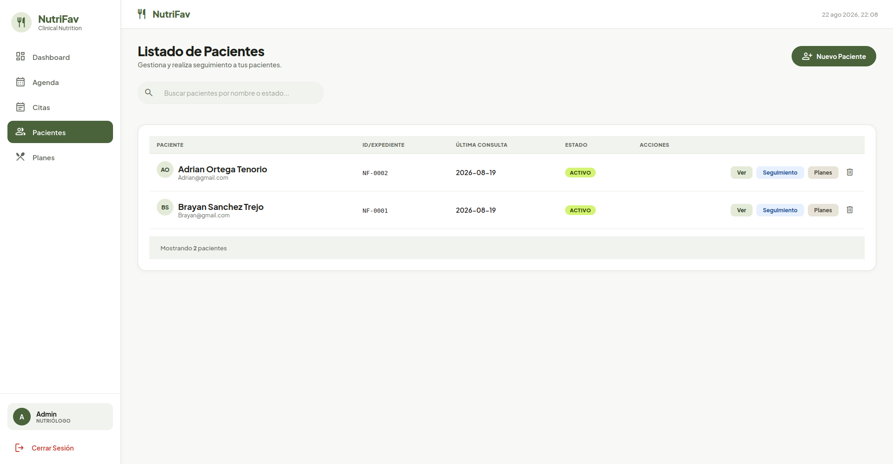
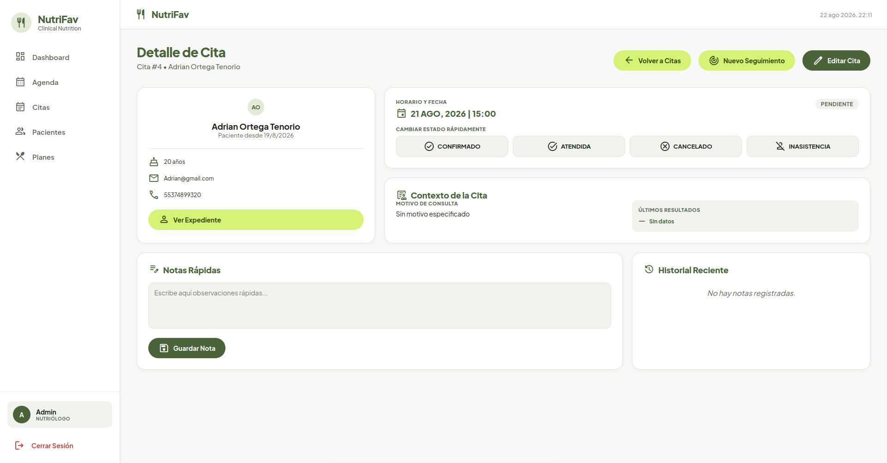
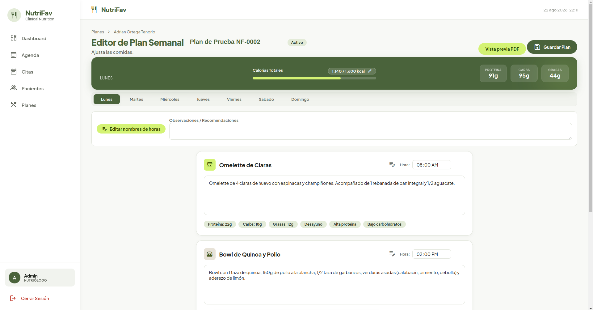

<div align="center">
  
  
  
  <h1 style="font-size: 48px; margin: 0; color: #4a633b;">NutriFav</h1>
  
  <p style="font-size: 20px; font-weight: 500; color: #4a4a4a; margin-top: 8px;">
    <strong>Sistema de Gestión Integral para Consultorios de Nutrición</strong>
  </p>
  
  <p style="font-size: 16px; color: #62675d; max-width: 600px; margin: 8px auto;">
    Administra pacientes, agenda de citas, planes alimenticios personalizados y seguimiento antropométrico en una sola aplicación de escritorio.
  </p>

  <p>
    
    
    
    
    
  </p>
</div>

---

## 🖼️ Vista Rápida del Sistema

<table align="center" style="border-collapse: collapse; width: 100%; max-width: 900px; margin: 0 auto;">
  <tr>
    <td align="center" style="padding: 8px; background: #f8f9f6; border-radius: 12px;">
      
      <br /><strong style="color: #4a633b;"> Dashboard</strong><br />
      <span style="font-size: 12px; color: #62675d;">Estadísticas, citas del día y tareas pendientes</span>
    </td>
    <td align="center" style="padding: 8px; background: #f8f9f6; border-radius: 12px;">
      
      <br /><strong style="color: #4a633b;"> Agenda</strong><br />
      <span style="font-size: 12px; color: #62675d;">Vista anual y mensual con filtro por nutriólogo</span>
    </td>
  </tr>
  <tr>
    <td align="center" style="padding: 8px; background: #f8f9f6; border-radius: 12px;">
      
      <br /><strong style="color: #4a633b;"> Gestión de Pacientes</strong><br />
      <span style="font-size: 12px; color: #62675d;">Lista, búsqueda, estados y acceso rápido al expediente</span>
    </td>
    <td align="center" style="padding: 8px; background: #f8f9f6; border-radius: 12px;">
      
      <br /><strong style="color: #4a633b;"> Nueva Cita</strong><br />
      <span style="font-size: 12px; color: #62675d;">Autocompletado de pacientes, horarios y duración</span>
    </td>
  </tr>
  <tr>
    <td colspan="2" align="center" style="padding: 8px; background: #f8f9f6; border-radius: 12px;">
      
      <br /><strong style="color: #4a633b;"> Editor de Planes Alimenticios</strong><br />
      <span style="font-size: 12px; color: #62675d;">Comidas por día, macros, etiquetas y exportación a PDF</span>
    </td>
  </tr>
</table>

---

##  Módulos y Funcionalidades

<table style="width: 100%; border-collapse: collapse; max-width: 900px; margin: 0 auto;">
  <tr>
    <td style="padding: 16px; background: #f1f3ee; border-radius: 12px; width: 33%; vertical-align: top;">
      <h3 style="color: #4a633b; margin: 0 0 8px 0;"> Pacientes</h3>
      <ul style="margin: 0; padding-left: 20px; color: #1c201a; font-size: 14px;">
        <li>Expediente clínico digital completo</li>
        <li>Antecedentes patológicos y no patológicos</li>
        <li>Historial gineco-obstétrico</li>
        <li>Hábitos alimenticios y de actividad física</li>
        <li>Estado (Activo / Inactivo)</li>
      </ul>
    </td>
    <td style="padding: 16px; background: #f1f3ee; border-radius: 12px; width: 33%; vertical-align: top;">
      <h3 style="color: #4a633b; margin: 0 0 8px 0;"> Agenda & Citas</h3>
      <ul style="margin: 0; padding-left: 20px; color: #1c201a; font-size: 14px;">
        <li>Vista anual (resumen de meses)</li>
        <li>Vista mensual con eventos por día</li>
        <li>Filtro por nutriólogo asignado</li>
        <li>Estados: Confirmada, Pendiente, Atendida, Inasistencia, Cancelada</li>
        <li>Adjunto de documentos en la cita</li>
      </ul>
    </td>
    <td style="padding: 16px; background: #f1f3ee; border-radius: 12px; width: 33%; vertical-align: top;">
      <h3 style="color: #4a633b; margin: 0 0 8px 0;"> Seguimiento</h3>
      <ul style="margin: 0; padding-left: 20px; color: #1c201a; font-size: 14px;">
        <li>Registro de peso, IMC, grasa corporal</li>
        <li>Circunferencias (cintura, cadera, brazo, muslo, etc.)</li>
        <li>Pliegues (bicipital, tricipital, subescapular, etc.)</li>
        <li>Gráfico de evolución de peso</li>
        <li>Progreso visual hacia la meta</li>
      </ul>
    </td>
  </tr>
  <tr>
    <td style="padding: 16px; background: #f1f3ee; border-radius: 12px; width: 33%; vertical-align: top;">
      <h3 style="color: #4a633b; margin: 0 0 8px 0;"> Planes Alimenticios</h3>
      <ul style="margin: 0; padding-left: 20px; color: #1c201a; font-size: 14px;">
        <li>Editor visual por días de la semana</li>
        <li>Nombres personalizados para cada hora (Ej. "Desayuno", "Comida")</li>
        <li>Macronutrientes (proteínas, carbohidratos, grasas)</li>
        <li>Etiquetas y categorización de comidas</li>
        <li>Exportación a PDF con tabla semanal</li>
      </ul>
    </td>
    <td style="padding: 16px; background: #f1f3ee; border-radius: 12px; width: 33%; vertical-align: top;">
      <h3 style="color: #4a633b; margin: 0 0 8px 0;"> Galería de Fotos</h3>
      <ul style="margin: 0; padding-left: 20px; color: #1c201a; font-size: 14px;">
        <li>Subida de fotos por ángulo (Frente, Perfil, etc.)</li>
        <li>Vista en cuadrícula</li>
        <li>Comparación lado a lado de 2 fotos</li>
        <li>Visualización en pantalla completa</li>
        <li>Eliminación de fotos</li>
      </ul>
    </td>
    <td style="padding: 16px; background: #f1f3ee; border-radius: 12px; width: 33%; vertical-align: top;">
      <h3 style="color: #4a633b; margin: 0 0 8px 0;"> Tareas</h3>
      <ul style="margin: 0; padding-left: 20px; color: #1c201a; font-size: 14px;">
        <li>Categorías: Clínica, Administrativa, Seguimiento</li>
        <li>Creación rápida desde el Dashboard</li>
        <li>Marcado como completadas</li>
        <li>Eliminación de tareas</li>
        <li>Persistencia en base de datos</li>
      </ul>
    </td>
  </tr>
</table>

---

## 🗄️ Esquema de Base de Datos

NutriFav utiliza **SQLite3** con las siguientes tablas principales:

| Tabla | Descripción |
|-------|-------------|
| `administradores` | Usuarios del sistema (nutriólogos) con rol y credenciales hasheadas |
| `pacientes` | Expediente completo con más de 50 campos clínicos |
| `citas` | Agenda de citas con estados, fechas, horas y documentos adjuntos |
| `seguimiento` | Registros antropométricos con medidas detalladas |
| `planes` | Planes alimenticios con comidas por día y macros |
| `prescripciones` | Relación entre pacientes y planes activos |
| `notas` | Notas clínicas asociadas a pacientes |
| `fotos` | Galería de imágenes de progreso |
| `tareas` | Sistema de tareas pendientes |

---

## ⚙️ Stack Tecnológico

<div align="center" style="display: flex; flex-wrap: wrap; gap: 10px; justify-content: center; margin: 16px 0;">
  <span style="background: #e8f0e0; color: #2d3d24; padding: 8px 20px; border-radius: 20px; font-weight: 600; font-size: 14px;">HTML5</span>
  <span style="background: #e8f0e0; color: #2d3d24; padding: 8px 20px; border-radius: 20px; font-weight: 600; font-size: 14px;">CSS3 (Flexbox / Grid)</span>
  <span style="background: #e8f0e0; color: #2d3d24; padding: 8px 20px; border-radius: 20px; font-weight: 600; font-size: 14px;">JavaScript (ES6+)</span>
  <span style="background: #47848F; color: #ffffff; padding: 8px 20px; border-radius: 20px; font-weight: 600; font-size: 14px;">Electron</span>
  <span style="background: #003B57; color: #ffffff; padding: 8px 20px; border-radius: 20px; font-weight: 600; font-size: 14px;">SQLite3</span>
  <span style="background: #4a633b; color: #ffffff; padding: 8px 20px; border-radius: 20px; font-weight: 600; font-size: 14px;">bcryptjs</span>
  <span style="background: #e67e22; color: #ffffff; padding: 8px 20px; border-radius: 20px; font-weight: 600; font-size: 14px;">jsPDF</span>
  <span style="background: #2c3e50; color: #ffffff; padding: 8px 20px; border-radius: 20px; font-weight: 600; font-size: 14px;">html2canvas</span>
</div>

---

## ✅ Instalación y Ejecución Local
Sigue estos pasos para instalar el proyecto:

# Clonar el repositorio
git clone https://github.com/H8DZZ/NutriFav.git

cd nutrifav

# Instalar dependencias
npm install electron electron-builder --save-dev

npm install

# Ejecutar la aplicación
npm start


## 📁 Estructura del Proyecto

```bash
nutrifav/
├── 0.css
├── 0.html
├── assets
│   ├── fonts
│   │   └── MaterialSymbolsRounded-VariableFont_FILL,GRAD,opsz,wght.ttf
│   └── js
│       ├── html2canvas.min.js
│       └── jspdf.umd.min.js
├── base.css
├── css
│   ├── 10.css
│   ├── 11.css
│   ├── 12.css
│   ├── 1.css
│   ├── 2.css
│   ├── 3.css
│   ├── 4.css
│   ├── 5.css
│   ├── 6.css
│   ├── 7.css
│   ├── 8.css
│   ├── 9.css
│   └── all.css
├── fix.css
├── index.html
├── layout-fix.css
├── main.css
├── main.js
├── package.json
├── package-lock.json
├── preload.js
├── router.js
├── screenshots
│   ├── agenda.png
│   ├── cita-modal.png
│   ├── dashboard.png
│   ├── dieta.png
│   └── pacientes.png
├── src
│   └── js
│       ├── agenda.js
│       ├── appointments.js
│       ├── auth.js
│       ├── citas.js
│       ├── dashboard.js
│       ├── database.js
│       ├── database-renderer.js
│       ├── dataService.js
│       ├── detalle-cita.js
│       ├── editor-plan.js
│       ├── expediente.js
│       ├── fotos.js
│       ├── pacientes.js
│       ├── planes.js
│       ├── prescripciones.js
│       ├── registro-seguimiento.js
│       ├── router.js
│       ├── seguimiento.js
│       └── tasks.js
└── views
    ├── agenda.html
    ├── citas.html
    ├── dashboard.html
    ├── detalle-cita.html
    ├── editor-plan.html
    ├── expediente.html
    ├── fotos.html
    ├── pacientes.html
    ├── planes.html
    ├── prescripciones.html
    ├── registro-seguimiento.html
    └── seguimiento.html
```
---

## Documentación

<a href="./Documentacion_NutriFav.docx" target="_blank" style="text-decoration: none; display: block; max-width: 700px; margin: 16px auto;">

  <div style="background: #f1f3ee; border-radius: 12px; padding: 24px 32px; border: 1px solid #e0e4da; text-align: center; transition: background 0.2s, transform 0.1s; cursor: pointer;">
    <div style="display: flex; align-items: center; justify-content: center; gap: 16px; flex-wrap: wrap;">
      <div style="text-align: left;">
        <p style="margin: 4px 0 0 0; font-size: 14px; color: #62675d;">
          <code style="background: #e8e8e8; padding: 2px 10px; border-radius: 6px; font-size: 13px;">Documentacion_NutriFav.docx</code>
          <span style="margin: 0 8px;">•</span>
          Haz clic para abrir o descargar
        </p>
      </div>
    </div>

  </div>

</a>

---

## Créditos

<div style="display: flex; justify-content: center; gap: 30px; flex-wrap: wrap; margin: 16px 0;">

  <div style="background: #f1f3ee; border-radius: 12px; padding: 24px 32px; text-align: center; min-width: 200px; border: 1px solid #e0e4da;">
    <p style="margin: 0; font-weight: 700; font-size: 18px; color: #4a633b;">Adrian Ortega Tenorio</p>
    <p style="margin: 4px 0 0 0; font-size: 14px; color: #62675d;">Desarrollador Principal</p>
    <p style="margin: 6px 0 0 0;">
      <a href="https://github.com/H8DZZ" target="_blank" style="display: inline-flex; align-items: center; gap: 6px; color: #4a633b; text-decoration: none; font-weight: 600; font-size: 14px;">
        <svg height="20" width="20" viewBox="0 0 16 16" fill="#4a633b"><path d="M8 0C3.58 0 0 3.58 0 8c0 3.54 2.29 6.53 5.47 7.59.4.07.55-.17.55-.38 0-.19-.01-.82-.01-1.49-2.01.37-2.53-.49-2.69-.94-.09-.23-.48-.94-.82-1.13-.28-.15-.68-.52-.01-.53.63-.01 1.08.58 1.23.82.72 1.21 1.87.87 2.33.66.07-.52.28-.87.51-1.07-1.78-.2-3.64-.89-3.64-3.95 0-.87.31-1.59.82-2.15-.08-.2-.36-1.02.08-2.12 0 0 .67-.21 2.2.82.64-.18 1.32-.27 2-.27.68 0 1.36.09 2 .27 1.53-1.04 2.2-.82 2.2-.82.44 1.1.16 1.92.08 2.12.51.56.82 1.27.82 2.15 0 3.07-1.87 3.75-3.65 3.95.29.25.54.73.54 1.48 0 1.07-.01 1.93-.01 2.2 0 .21.15.46.55.38A8.013 8.013 0 0016 8c0-4.42-3.58-8-8-8z"/></svg>
        @H8DZZ
      </a>
    </p>
  </div>

  <div style="background: #f1f3ee; border-radius: 12px; padding: 24px 32px; text-align: center; min-width: 200px; border: 1px solid #e0e4da;">
    <p style="margin: 0; font-weight: 700; font-size: 18px; color: #4a633b;">Brayan Sanchez Trejo</p>
    <p style="margin: 4px 0 0 0; font-size: 14px; color: #62675d;">Co-Desarrollador</p>
    <p style="margin: 6px 0 0 0;">
      <a href="https://github.com/brayanst282004-art" target="_blank" style="display: inline-flex; align-items: center; gap: 6px; color: #4a633b; text-decoration: none; font-weight: 600; font-size: 14px;">
        <svg height="20" width="20" viewBox="0 0 16 16" fill="#4a633b"><path d="M8 0C3.58 0 0 3.58 0 8c0 3.54 2.29 6.53 5.47 7.59.4.07.55-.17.55-.38 0-.19-.01-.82-.01-1.49-2.01.37-2.53-.49-2.69-.94-.09-.23-.48-.94-.82-1.13-.28-.15-.68-.52-.01-.53.63-.01 1.08.58 1.23.82.72 1.21 1.87.87 2.33.66.07-.52.28-.87.51-1.07-1.78-.2-3.64-.89-3.64-3.95 0-.87.31-1.59.82-2.15-.08-.2-.36-1.02.08-2.12 0 0 .67-.21 2.2.82.64-.18 1.32-.27 2-.27.68 0 1.36.09 2 .27 1.53-1.04 2.2-.82 2.2-.82.44 1.1.16 1.92.08 2.12.51.56.82 1.27.82 2.15 0 3.07-1.87 3.75-3.65 3.95.29.25.54.73.54 1.48 0 1.07-.01 1.93-.01 2.2 0 .21.15.46.55.38A8.013 8.013 0 0016 8c0-4.42-3.58-8-8-8z"/></svg>
        @brayanst282004-art
      </a>
    </p>
  </div>

</div>

---

